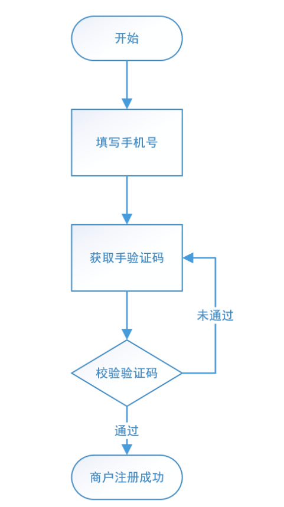
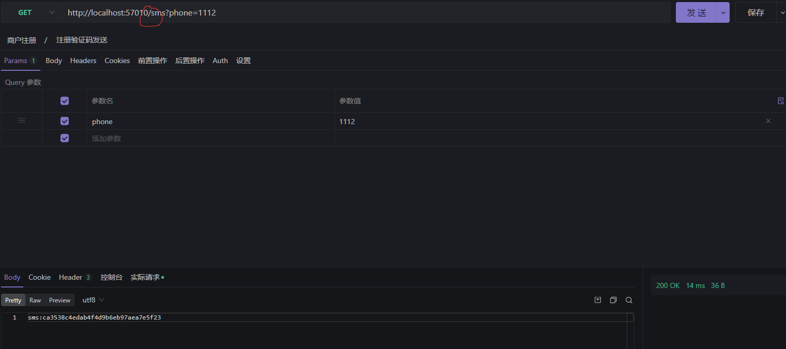
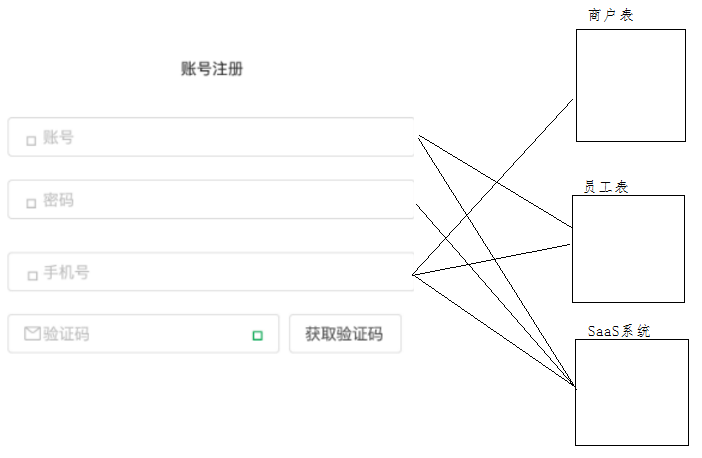
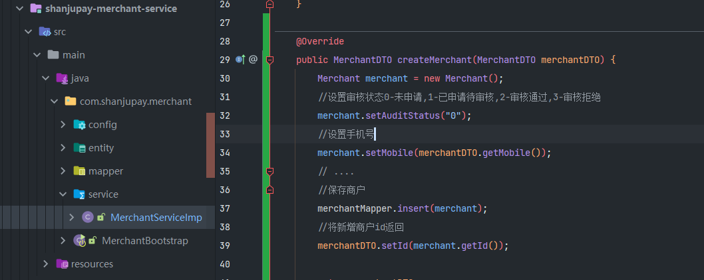
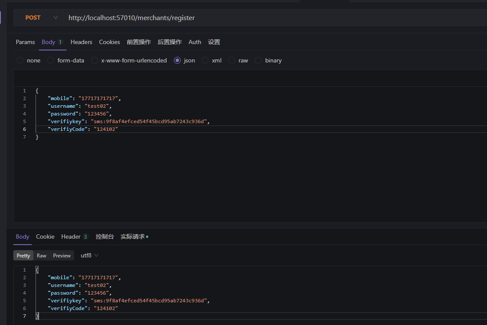
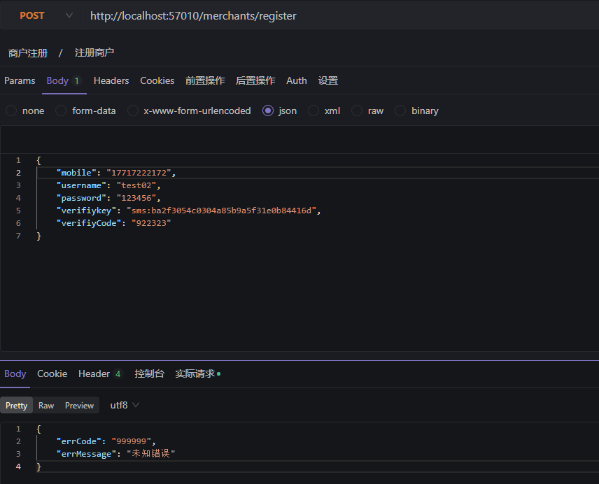
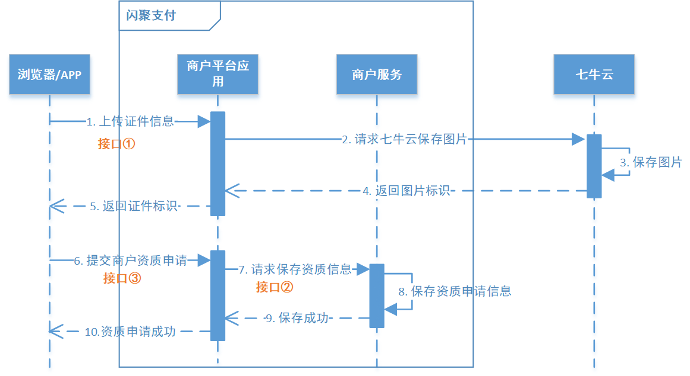

# 一、项目搭建

在Nacos的配置中心写入的配置 - 不能直接粘贴


## nacos配置

- Data ID: spring-boot-http.yaml        Group:  COMMON_GROUP

```yaml
#HTTP格式配置
spring:
  http:
    encoding:
      charset: UTF-8
      force: true
      enabled: true
  messages:
    encoding: UTF-8

#tomcat头信息(用户ip和访问协议)及访问路径配置
server:
  tomcat:
    remote_ip_header: x-forwarded-for
    protocol_header: x-forwarded-proto
  servlet:
    context-path: /
  use-forward-headers: true
#服务监控与管理配置，运维相关
management:
  endpoints:
    web:
      exposure:
        include: refresh,health,info,env
```

- Data ID:  merchant-application.yaml       Group:  SHANJUPAY_GROUP

```yaml
#覆盖访问路径
server:
    servlet:
        context‐path: /merchant
        
#启用Swagger
swagger:
    enable: true
```

- Data ID:  merchant-service.yaml       Group:  SHANJUPAY_GROUP

```yaml
# 覆盖spring‐boot‐http.yaml的项目
server:
  servlet:
    context‐path: /merchant-service

# 覆盖spring‐boot‐starter‐druid.yaml的项目
spring:
  datasource:
    druid:
      url: jdbc:mysql://124.220.169.221:3306/shanjupay_merchant_service?useUnicode=true&characterEncoding=UTF-8&serverTimezone=Asia/Shanghai&useSSL=false
      username: root
      password: 123456

# 覆盖spring‐boot‐mybatis‐plus.yaml的项目
mybatis‐plus:
  typeAliasesPackage: com.shanjupay.merchant.entity
  mapper‐locations: classpath:com/shanjupay/*/mapper/*.xml
```

- Data ID:  spring-boot-starter-druid.yaml       Group:  COMMON_GROUP

```yaml
spring:
  datasource:
    type: com.alibaba.druid.pool.DruidDataSource
    driver-class-name: com.mysql.cj.jdbc.Driver
    url: jdbc:mysql://124.220.169.221:3306/oauth?useUnicode=true
    username: root
    password: 123456
    druid:
      initial-size: 5
      min-idle: 5
      max-active: 20
      max-wait: 60000
      time-between-eviction-runs-millis: 60000
      min-evictable-idle-time-millis: 300000
      validation-query: SELECT 1 FROM DUAL
      test-while-idle: true
      test-on-borrow: true
      test-on-return: false
      pool-prepared-statements: true
      max-pool-prepared-statement-per-connection-size: 20
      filter:
        stat:
          slow-sql-millis: 1
          log-slow-sql: true
      filters: config,stat,wall,log4j2
      web-stat-filter:
        enabled: true
        url-pattern: /*
        exclusions: "*.js,*.gif,*.jpg,*.png,*.css,*.ico,/druid/*"
        session-stat-enable: false
        session-stat-max-count: 1000
        principal-cookie-name: admin
        principal-session-name: admin
        profile-enable: true
      stat-view-servlet:
        enabled: true
        url-pattern: /druid/*
        allow: 127.0.0.1,192.168.163.1,124.220.169.221
        deny: 192.168.1.73
        reset-enable: false
        login-password: admin
        login-username: admin
      aop-patterns: com.shanjupay.*.service.*
```

- Data ID:  spring-boot-mybatis-plus.yaml       Group:  COMMON_GROUP

```yaml
mybatis-plus:
  configuration:
    cache-enabled: false
    map-underscore-to-camel-case: true
  global-config:
    id-type: 0
    field-strategy: 0
    db-column-underline: true
    refresh-mapper: true
  typeAliasesPackage: com.shanjupay.user.entity
  mapper-locations: classpath:com/shanjupay/*/mapper/*.xml
```

注意在项目中要更改数据的环境地址


# 二、验证码服务        

使用腾讯开源的验证码服务  `git clone https://github.com/fightingape/sailing.git`

因为没有购买短信服务，使验证码在控制台打印


因为短信服务是连接到redis 中的，所以需要启动 redis

- 测试


- 验证码的 swagger 文档


# 三、商户注册加入验证码

## 3.1 商户注册流程图



1. 用户填写手机号、账号、密码等信息

   - 页面交互图

   

2. 点击获取手机验证码

3. 输入验证码，点击注册

4. 商户注册成功


## 3.2 资质申请流程图


1. 商户填写资质信息

   - 页面交互图

   

2. 上传营业执照和法人身份证图片

   - 页面交互图

   

3. 提交资质信息

4. 平台运营人员对商户资质信息进行审核

5. 审核通过后，完成资质申请


# 四、商户注册

## 4.1 需求分析

### 4.1.1 系统交互流程

商户注册交互流程：


商户注册的流程由商户平台应用、商户服务、SaaS平台、验证码服务四个微服务之间进行交互完成，各微服务的职 责介绍如下：

1. 商户平台应用：此应用主要为商户提供业务功能，包括：商户资质申请、员工管理、门店管理等功能。 
2. 商户服务： 提供商户管理的相关服务接口，供其它微服务调用，主要为商户平台应用提供接口服务，功能包 括：商户基本信息管理、资质申请、商户应用管理、渠道参数配置、商户员工信息管理、商户门店管理等。 
3. SaaS平台：闪聚支付项目是一个SaaS平台 ，所谓SaaS平台即多个用户租用平台的业务功能，这样用户即可省 去软件系统开发的成本，每个商户就是一个租户，所以又称为多租户系统。 SaaS平台提供租户管理、账号管理、权限管理、资源管理、套餐管理、系统认证授权等功业务功能。在上图商户注 册的流程中，商户注册的账号等信息需要写入SaaS平台，由SaaS平台统一管理账号，分配权限，商户统一通过 SaaS平台登录闪聚支付。 
4. 验证码服务：提供获取短信验证码、校验验证码的接口。

商户使用手机号进行注册，平台通过校验手机验证码来确认是否本人在注册。


交互流程:

1.  前端请求商户平台应用进行注册 
2. 商户平台应用获取短信验证码 
3. 前端携带手机验证码、账号、密码等信息请求商户平台应用确认注册 
4. 验证码校验通过后请求商户服务新增商户
5. . 商户服务请求SaaS平台新增租户并初始化管理员 
6. SaaS平台返回创建成功给商户服务商户服务新增商户下根门店信息 
7. 商户服务新增商户下员工信息 
8. 注册成功

### 4.1.2 开发步骤

1. 首先实现商户信息在商户服务注册成功（暂时不与SaaS平台交互） 商户信息只写入商户数据库，暂时不与SaaS平台交互。 
2. 待商户信息注册成功，资质申请通过、支付参数配置完成再与SaaS平台进行对接。 与SaaS平台交互前需要部署SaaS平台，学习SaaS暴露的接口及认证接口，接通SaaS方可实现用户登录，此部分放 在最后实现。

## 4.2 获取验证码

### 4.2.1 RestTemplate

- 引入依赖

```
<!‐‐ okhttp3依赖 ‐‐>
<dependency>
    <groupId>com.squareup.okhttp3</groupId>
    <artifactId>okhttp</artifactId>
</dependency>
```

- 初始化 RestTemplate

  ```java
  @Bean
  public RestTemplate restTemplate() {
  	return new RestTemplate(new OkHttp3ClientHttpRequestFactory());
  }
  ```

- 测试

```java
//获取网页内容
@Test
public void gethtml(){
String url = "http://www.baidu.com/";
ResponseEntity<String> forEntity = restTemplate.getForEntity(url, String.class);
String body = forEntity.getBody();
System.out.println(body);
}
```


网页内容中中文乱码解决方案： 

- 原因： 当RestTemplate默认使用String存储body内容时默认使用ISO_8859_1字符集。 
- 解决： 配置StringHttpMessageConverter 消息转换器，使用utf-8字符集。

```java
@Bean
    public RestTemplate restTemplate(){
        RestTemplate restTemplate = new RestTemplate(new OkHttp3ClientHttpRequestFactory());
        //消息转换器
        List<HttpMessageConverter<?>> msg = restTemplate.getMessageConverters();
        //配置消息转换器StringHttpMessageConverter，并设置utf‐8
        msg.set(1, new StringHttpMessageConverter(StandardCharsets.UTF_8));//支持中文字符集，默认ISO‐8859‐1，支持utf‐8

        return restTemplate;
    }
```


<font color = red>**注：因为调用了restTemplate的方法导致出现了错误，应该调用的是对象**</font>


在nacos中配置验证码的过期时间


<font color=red>**注：因为不知原因，到时配置的 context-path 不可用**</font>




### 4.2.2  商户注册信息存储模型



这个验证码不需要保存到数据库，但是在注册时需要验证，所以就需要设置一层数据层来保存


### 4.2.3 商户注册表数据模型


- 接口定义


- 接口实现



### 4.2.4 定义不同合实现层数据

因为每一层用到的数据都不一样，有的保留在数据库，有的只需要保留几分钟（如：验证码）


```java
@ApiModel(value = "MerchantRegisterVO", description = "商户注册信息")
@Data
public class MerchantRegisterVO implements Serializable {

    @ApiModelProperty("商户手机号")
    private String mobile;

    @ApiModelProperty("商户用户名")
    private String username;

    @ApiModelProperty("商户密码")
    private String password;

    @ApiModelProperty("验证码的key")
    private String verifiykey;

    @ApiModelProperty("验证码")
    private String verifiyCode;

}
```

### 4.2.5 校验验证码

- 接口定义


- 接口实现

  ```java
  publi cvoid checkVerifiyCode(String verifiyKey,String verifiyCode) {
          //实现校验验证码的逻辑
          String url = smsUrl+"/verify?
          name=sms&verificationCode="+verifiyCode+"&verificationKey="+verifiyKey;
          Map responseMap = null;
          try {
              //请求校验验证码
              ResponseEntity<Map> exchange = restTemplate.exchange(url, HttpMethod.POST,
                      HttpEntity.EMPTY, Map.class);
              responseMap = exchange.getBody();
              log.info("校验验证码，响应内容：{}",JSON.toJSONString(responseMap));
          } catch (Exception e) {
              e.printStackTrace();
              log.info(e.getMessage(),e);
              throw new RuntimeException("验证码错误");
          }
          if(responseMap == null || responseMap.get("result")==null || !(Boolean)
                  responseMap.get("result")){
              throw new RuntimeException("验证码错误");
          }
      }
  ```

- 接口调用

  ```java
  @PostMapping("/merchants/register")
  public MerchantRegisterVO registerMerchant(@RequestBody MerchantRegisterVO merchantRegister)
  {
      //校验验证码
      smsService.checkVerifiyCode(merchantRegister.getVerifiykey(),
      merchantRegister.getVerifiyCode());
      return merchantRegister;
  }
  ```

### 4.2.6 注册商户实现

```java
@Reference
private MerchantService merchantService;
@PostMapping("/merchants/register")
public MerchantRegisterVO registerMerchant(@RequestBody MerchantRegisterVO merchantRegister){
    //校验验证码
    smsService.checkVerifiyCode(merchantRegister.getVerifiykey(),
    merchantRegister.getVerifiyCode());
    //注册商户
    MerchantDTO merchantDTO = new MerchantDTO();
    merchantDTO.setUsername(merchantRegister.getUsername());
    merchantDTO.setMobile(merchantRegister.getMobile());
    merchantDTO.setPassword(merchantRegister.getPassword());
    merchantService.createMerchant(merchantDTO);
    return merchantRegister;
}

```

测试结果：




## 4.3 MapStruct对象转换

### 4.3.1 数据传输对象

在商户注册开发过程中用于数据传输的对象有MerchantRegisterVO、MerchantDTO、entity(实体类)，它们的用 途如下： 

1. MerchantRegisterVO用于应用层接收前端请求及响应前端数据。 
2. MerchantDTO 用于服务层传入及响应数据。 
3. entity(实体类) 用于持久层传入及响应数据。


数据传输对象（Data Transfer Object）是系统在交互过程中根据需要及规范将数据封装到数据对象中进行传输。 

本项目数据传输对象的规范： 

1. 应用层 
   - 如没有接口参数的特殊要求，应用层使用DTO结尾的对象传输，否则单独定义VO结尾的对象传输。 
2. 服务层 
   - 统一使用DTO结尾的对象传输。 
3. 持久层 
   - 统一使用Entity对象传输。

### 4.3.2 MapStruct解决数据传输对象转换的繁琐

MapStruct是一个代码生成器，它基于约定优于配置的方法大大简化了Java Bean对象之间的映射转换的实现。 MapStruct 使用简单的方法即可完成对象之间的转换，它速度快、类型安全且易于理解。 

> 官方地址：https://mapstruct.org/

1. 添加依赖

   在使用MapStruct的工程添加MapStruct依赖：

   ```java
   <dependency>
   <groupId>org.mapstruct</groupId>
   <artifactId>mapstruct‐jdk8</artifactId>
   </dependency>
   <dependency>
   <groupId>org.mapstruct</groupId>
   <artifactId>mapstruct‐processor</artifactId>
   <version>${org.mapstruct.version}</version>
   </dependency>
   ```

2. 服务层对象转换

   - 在商户服务工程定义商户对象转换类 

   - 定义MerchantConvert转换类，使用@Mapper注解快速实现对象转换

   ```java
   import com.shanjupay.merchant.api.dto.MerchantDTO;
   import com.shanjupay.merchant.entity.Merchant;
   import org.mapstruct.Mapper;
   import org.mapstruct.factory.Mappers;
   @Mapper
   public interface MerchantCovert {
       MerchantCovert INSTANCE = Mappers.getMapper(MerchantCovert.class);
       MerchantDTO entity2dto(Merchant entity);
       Merchant dto2entity(MerchantDTO dto);
        //list之间的转换
   	List<MerchantDTO> listentity2dto(List<Merchant> list);
   }
   ```

   - 测试

   ```java
   public static void main(String[] args) {
       //dto转entity
       MerchantDTO merchantDTO = new MerchantDTO();
       merchantDTO.setUsername("测试");
       merchantDTO.setPassword("111");
       Merchant entity = MerchantCovert.INSTANCE.dto2entity(merchantDTO);
       //entity转dto
       entity.setMobile("123444554");
       MerchantDTO merchantDTO1 = MerchantCovert.INSTANCE.entity2dto(entity);
       System.out.println(merchantDTO1);
       
       //测试list之间的转换
           List<Merchant> list_entity = new ArrayList<>();
           list_entity.add(entity);
           List<MerchantDTO> merchantDTOS = MerchantCovert.INSTANCE.listentity2dto(list_entity);
           System.out.println(merchantDTOS);
   }
   ```

3. 应用层对象转换

   - 在商户平台应用工程定义商户对象转换类

   ```java
   import com.shanjupay.merchant.api.dto.MerchantDTO;
   import com.shanjupay.merchant.vo.MerchantRegisterVO;
   import org.mapstruct.Mapper;
   import org.mapstruct.factory.Mappers;
   @Mapper
   public interface MerchantRegisterConvert {
       MerchantRegisterConvert INSTANCE = Mappers.getMapper(MerchantRegisterConvert.class);
       MerchantDTO vo2dto(MerchantRegisterVO vo);
       MerchantRegisterVO dto2vo(MerchantDTO dto);
   }
   ```

   ### 4.3.3 代码优化

   1. 优化服务层代码 

      修改商户服务工程MerchantServiceImpl中的createMerchant方法：

      ```java
      public MerchantDTO createMerchant(MerchantDTO merchantDTO) {
          //将dto转成entity
          Merchant entity = MerchantCovert.INSTANCE.dto2entity(merchantDTO);
          //设置审核状态0‐未申请,1‐已申请待审核,2‐审核通过,3‐审核拒绝
          entity.setAuditStatus("0");
          //保存商户信息
          merchantMapper.insert(entity);
          //将entity转成 dto
          MerchantDTO merchantDTONew = MerchantCovert.INSTANCE.entity2dto(entity);
          return merchantDTONew;
      }
      ```

   2. 代码应用层代码 

      修改商户平台应用工程MerchantController中的registerMerchant方法：

      ```java
      @PostMapping("/merchants/register")
      public MerchantRegisterVO registerMerchant(@RequestBody MerchantRegisterVO merchantRegister){
          //校验验证码
          smsService.verificationMessageCode(merchantRegister.getVerifiykey(),
          merchantRegister.getVerifiyCode());
          //注册商户
          MerchantDTO merchantDTO = MerchantRegisterConvert.INSTANCE.vo2dto(merchantRegister);
          merchantService.createMerchant(merchantDTO);
          return merchantRegister;
      }
      
      ```

## 4.4 异常处理

### 4.4.1 异常信息格式

系统在交互中难免会有异常发生，前端为了解析异常信息向用户提示特定义了异常信息的返回格式，如下： 

1. 返回response状态说明

   | **状态码** | **说明**                     |
   | ---------- | ---------------------------- |
   | 200        | 成功                         |
   | 401        | 没有权限                     |
   | 500        | 程序错误（需要自定义错误体） |

2. 自定义错误体

   ```json
   {
       "errCode": "000000",
       "errMessage": "错误说明"
   }
   ```

### 4.4.2 异常处理流程


1. 在服务层抛出自定义异常类型及不可预知异常类型。

   - 上图中BusinessException为系统的自定义异常类型，程序中在代码显示抛出该异常，此类异常是程序员可预知 的。 

   - 另一部分是系统无法预知的异常，如：数据库无法连接，服务器宕机等场景下所抛出的异常，此类异常是程序员无 法预知的异常。 

2. 应用层接收到服务层抛出异常继续向上抛出，应用层自己也可以抛出自定义异常类型及不可预知异常类型

3. 统一异常处理器捕获到异常进行解析。

   - 判断如果为自定义异常则直接取出错误代码及错误信息，因为程序员在抛出自定义异常时已将错误代码和异常信息 指定。 如果为不可预知的异常则统一定义为99999异常代码。 

4. 统一异常处理器将异常信息格式为前端要求的格式响应给前端。 服务端统一将异常信息封装在下边的Json格式中返回：

```json
{
    "errCode": "000000",
    "errMessage": "错误说明"
}
```

### 4.4.3 自定义业务异常类

在最上面的一层定义异常处理类

1. 在shanjupay-common工程的com.shanjupay.common.domain包下添加业务异常类BusinessException

   ```java
   public class BusinessException extends RuntimeException {
   	//错误代码
       private ErrorCode errorCode;
   
       public BusinessException(ErrorCode errorCode) {
           super();
           this.errorCode = errorCode;
       }
       public BusinessException() {
           super();
       }
   
       public void setErrorCode(ErrorCode errorCode) {
           this.errorCode = errorCode;
       }
   
       public ErrorCode getErrorCode() {
           return errorCode;
       }
   }
   ```

2. 定义错误代码

   ````java
   /**
    * 异常编码 0成功、-1熔断、 -2 标准参数校验不通过 -3会话超时
    * 前两位:服务标识
    * 中间两位:模块标识
    * 后两位:异常标识
    */
   public enum CommonErrorCode implements ErrorCode {
   
   	////////////////////////////////////公用异常编码 //////////////////////////
   	E_100101(100101,"传入参数与接口不匹配"),
   	E_100102(100102,"验证码错误"),
   	E_100103(100103,"验证码为空"),
   	E_100104(100104,"查询结果为空"),
   	E_100105(100105,"ID格式不正确或超出Long存储范围"),
   	E_100106(100106,"上传错误"),
   	E_100107(100107,"发送验证码错误"),
   	E_100108(100108,"传入对象为空"),
   	E_100109(100109,"手机号格式不正确"),
   	E_100110(100110,"用户名为空"),
   	E_100111(100111,"密码为空"),
   	E_100112(100112,"手机号为空"),
   	E_100113(100113,"手机号已存在"),
   	E_100114(100114,"用户名已存在"),
   	E_100115(100115,"密码不正确"),
   
   	////////////////////////////////////SAAS服务异常编码110 //////////////////////////
   	E_110001(110001,"账号不存在"),
   	E_110002(110002,"角色编码在同一租户中已存在，不可重复"),
   	E_110003(110003,"角色为空"),
   	E_110004(110004,"角色已绑定账号，被使用中不可删除"),
   	E_110005(110005,"权限集合为空"),
   	E_110006(110006,"参数为空"),
   	E_110007(110007,"未查询到租户关联的角色"),
   	E_110008(110008,"账号被其他租户使用，不可删除"),
   
   	////////////////////////////////////商户服务异常编码200//////////////////////////
   	E_200001(200001,"企业名称不能为空"),
   	E_200002(200002,"商户不存在"),
   	E_200003(200003,"商户还未通过认证审核，不能创建应用"),
   	E_200004(200004,"应用名称已经存在，请使用其他名称"),
   	E_200005(200005,"应用不属于当前商户"),
   	E_200006(200006,"门店不属于当前商户"),
   	E_200007(200007,"二维码生成失败"),
   	E_200008(200008,"授权码为空"),
   	E_200009(200009,"订单标题为空"),
   	E_200010(200010,"订单金额为空"),
   	E_200011(200011,"授权码格式有误"),
   	E_200012(200012,"租户不存在"),
   	E_200013(200013,"员工不存在"),
   	E_200014(200014,"商户下未设置根门店"),
   	E_200015(200015,"未查询到该门店"),
   	E_200016(200016,"资质申请已通过，无需重复申请"),
   	E_200017(200017,"商户在当前租户下已经注册，不可重复注册"),
   
   	////////////////////////////////////交易服务异常编码300//////////////////////////
   	E_300001(300001,"支付金额为空"),
   	E_300002(300002,"openId为空"),
   	E_300003(300003,"appId为空"),
   	E_300004(300004,"商户id为空"),
   	E_300005(300005,"服务类型编码为空"),
   	E_300006(300006,"订单金额转换异常"),
   	E_300007(300007,"原始支付渠道为空"),
   	E_300008(300008,"已存在相同的支付参数，不可重复配置"),
   	E_300009(300009,"传入对象为空或者缺少必要的参数"),
   
   
   	E_300110(300110,"交易单号不能为空"),
   
   
   	////////////////////////////////////支付渠道代理服务异常编码400//////////////////
   	E_400001(400001,"微信确认支付失败"),
   
   	////////////////////////////////////运营服务异常编码500//////////////////
   
   	////////////////////////////////////特殊异常编码/////////////////////////////////////
   	E_999991(999991,"调用微服务-授权服务 被熔断"),
   	E_999992(999992,"调用微服务-用户服务 被熔断"),
   	E_999993(999993,"调用微服务-资源服务 被熔断"),
   	E_999994(999994,"调用微服务-同步服务 被熔断"),
   
   	E_999910(999910,"调用微服务-没有传tenantId租户Id"),
   	E_999911(999911,"调用微服务-没有json-token令牌"),
   	E_999912(999912,"调用微服务-json-token令牌解析有误"),
   	E_999913(999913,"调用微服务-json-token令牌有误-没有当前租户信息"),
   	E_999914(999914,"调用微服务-json-token令牌有误-该租户下没有权限信息"),
   
   	E_NO_AUTHORITY(999997,"没有访问权限"),
   	CUSTOM(999998,"自定义异常"),
   	/**
   	 * 未知错误
   	 */
   	UNKNOWN(999999,"未知错误");
   
   
   	private int code;
   	private String desc;
   
   	public int getCode() {
   		return code;
   	}
   
   	public String getDesc() {
   		return desc;
   	}
   
   	private CommonErrorCode(int code, String desc) {
   		this.code = code;
   		this.desc = desc;
   	}
   
   
   	public static CommonErrorCode setErrorCode(int code) {
   		for (CommonErrorCode errorCode : CommonErrorCode.values()) {
   			if (errorCode.getCode()==code) {
   				return errorCode;
   			}
   		}
   		return null;
   	}
   }
   ````

### 4.4.4 自定义业务异常处理器

1. 在shanjupay‐common工程的com.shanjupay.common.domain包下添加错误响应包装类RestErrorResponse:

   ```java
   @ApiModel(value = "RestErrorResponse", description = "错误响应参数包装")
   @Data
   public class RestErrorResponse {
   
       private String errCode;
   
       private String errMessage;
   
       public RestErrorResponse(String errCode,String errMessage){
           this.errCode = errCode;
           this.errMessage= errMessage;
       }
   }
   ```

2. 定义全局异常处理器

   全局异常处理器使用ControllerAdvice注解实现，ControllerAdvice是SpringMVC3.2提供的注解，用 ControllerAdvice可以方便实现对Controller面向切面编程，具体用法如下：

   1. ControllerAdvice和ExceptionHandler注解实现全局异常处理 
   2. ControllerAdvice和ModelAttribute注解实现全局数据绑定 
   3. ControllerAdvice生InitBinder注解实现全局数据预处理

   ControllerAdvice和ExceptionHandler结合可以捕获Controller抛出的异常，根据异常处理流程，Service和持久层 最终都会抛给Controller，所以此方案可以实现全局异常捕获，异常被捕获到即可格式为前端要的信息格式响应给前端。

   - 在shanjupay‐merchant‐application工程的com.shanjupay.merchant.common.intercept添加 GlobalExceptionHandler：

     ```java
     @ControllerAdvice//与@Exceptionhandler配合使用实现全局异常处理
     public class GlobalExceptionHandler {
         private static final Logger LOGGER = LoggerFactory.getLogger(GlobalExceptionHandler.class);
     
         //捕获Exception异常
         @ExceptionHandler(value = Exception.class)
         @ResponseBody
         @ResponseStatus(HttpStatus.INTERNAL_SERVER_ERROR)
         public RestErrorResponse processExcetion(HttpServletRequest request,
                                                  HttpServletResponse response,
                                                  Exception e){
             //解析异常信息
             //如果是系统自定义异常，直接取出errCode和errMessage
             if(e instanceof BusinessException){
                 LOGGER.info(e.getMessage(),e);
                 //解析系统自定义异常信息
                 BusinessException businessException= (BusinessException) e;
                 ErrorCode errorCode = businessException.getErrorCode();
                 //错误代码
                 int code = errorCode.getCode();
                 //错误信息
                 String desc = errorCode.getDesc();
                 return new RestErrorResponse(String.valueOf(code),desc);
             }
     
             LOGGER.error("系统异常：",e);
             //统一定义为99999系统未知错误
             return new RestErrorResponse(String.valueOf(CommonErrorCode.UNKNOWN.getCode()),CommonErrorCode.UNKNOWN.getDesc());
     
         }
     }
     ```

### 4.4.5  抛出自定义异常

按照异常处理流程，应用层抛出自定义异常由异常处理器进行解析。

<font color=red>**注：所有的自定义异常都需要甩出异常到 BusinessException  **</font>

1. 校验验证码接口抛出 BusinessException 

   修改商户平台应用工程中SmsServicer的verificationMessageCode接口

   ```java
   public void checkVerifyCode(String verifyKey, String verifyCode) throws BusinessException;
   ```

   接口实现中抛出异常自定义异常类型

   ```java
   /**
        * 校验手机验证码
        *
        * @param verifiyKey  验证码的key
        * @param verifiyCode 验证码
        */
       @Override
       public void checkVerifiyCode(String verifiyKey, String verifiyCode) throws BusinessException {
           //校验验证码的url
           String url = "http://localhost:56085/sailing/verify?name=sms&verificationCode="+verifiyCode+"&verificationKey="+verifiyKey;
   
           Map bodyMap = null;
           try {
               //使用restTemplate请求验证码服务
               ResponseEntity<Map> exchange = restTemplate.exchange(url, HttpMethod.POST, HttpEntity.EMPTY, Map.class);
               log.info("请求验证码服务，得到响应:{}", JSON.toJSONString(exchange));
               bodyMap = exchange.getBody();
           }catch (Exception e){
               e.printStackTrace();
               throw new BusinessException(CommonErrorCode.E_100102);
               //            throw new RuntimeException("校验验证码失败");
   
           }
           if(bodyMap == null || bodyMap.get("result") == null || !(Boolean) bodyMap.get("result")){
               throw new BusinessException(CommonErrorCode.E_100102);
           }
       }
   ```

2. 测试

   

3. 测试不可预知异常

   

   

### 4.4.6 校验商户手机号

校验商户手机号的唯一性，根据商户的手机号查询商户表，如果存在记录则说明已有相同的手机号重复，手机号不 唯一则抛出异常自定义异常。

#### 4.4.6.1 完善代码

1. 修改商户服务注册商户接口，添加抛出异常声明

   ```java
   /**
   * 商户注册
   * @return
   */
   MerchantDTO createMerchant(MerchantDTO merchantDTO) throws BusinessException;
   ```

2. 修改商户服务注册商户接口实现方法

   ```java
   @Override
       @Transactional
       public MerchantDTO createMerchant(MerchantDTO merchantDTO) throws BusinessException {
           //校验参数的合法性
           if(merchantDTO == null){
               throw new BusinessException(CommonErrorCode.E_100108);
           }
           //手机号非空校验
           if(StringUtils.isBlank(merchantDTO.getMobile())){
               throw new BusinessException(CommonErrorCode.E_100112);
           }
           //手机号格式校验
           if(!PhoneUtil.isMatches(merchantDTO.getMobile())){
               throw new BusinessException(CommonErrorCode.E_100109);
           }
           //联系人非空校验
           if (StringUtils.isBlank(merchantDTO.getUsername())) {
               throw new BusinessException(CommonErrorCode.E_100110);
           }
           //密码非空校验
           if (StringUtils.isBlank(merchantDTO.getPassword())) {
               throw new BusinessException(CommonErrorCode.E_100111);
           }
           //校验手机号的唯一性
           //根据手机号查询商户表，如果存在记录则说明手机号已存在
           Integer count = merchantMapper.selectCount(new LambdaQueryWrapper<Merchant>().eq(Merchant::getMobile, merchantDTO.getMobile()));
           if(count>0){
               throw new BusinessException(CommonErrorCode.E_100113);
           }
   
           //        Merchant merchant = new Merchant();
           //        merchant.setMobile(merchantDTO.getMobile());
           //..写入其它属性
           //使用MapStruct进行对象转换
           Merchant merchant = MerchantConvert.INSTANCE.dto2entity(merchantDTO);
           //审核状态为0-未进行资质申请
           merchant.setAuditStatus("0");
           //调用mapper向数据库写入记录
           merchantMapper.insert(merchant);
   
           //将dto中写入新增商户的id
           //        merchantDTO.setId(merchant.getId());
           //将entity转成dto
           return MerchantConvert.INSTANCE.entity2dto(merchant);
       }
   ```

3. 修改商户应用平台注册商户接口

   ```java
    @ApiOperation("商户注册")
       @ApiImplicitParam(value = "商户注册信息",name = "merchantRegisterVO",required = true,dataType = "MerchantRegisterVO",paramType = "body")
       @PostMapping("/merchants/register")
       public MerchantRegisterVO registerMerchant(@RequestBody MerchantRegisterVO merchantRegisterVO){
   
           //校验参数的合法性
           if(merchantRegisterVO == null){
               throw new BusinessException(CommonErrorCode.E_100108);
           }
           if(StringUtils.isBlank(merchantRegisterVO.getMobile())){
               throw new BusinessException(CommonErrorCode.E_100112);
           }
           //手机号格式校验
           if(!PhoneUtil.isMatches(merchantRegisterVO.getMobile())){
               throw new BusinessException(CommonErrorCode.E_100109);
           }
   
           //校验验证码
           smsService.checkVerifiyCode(merchantRegisterVO.getVerifiykey(),merchantRegisterVO.getVerifiyCode());
           //调用dubbo服务接口
           //        MerchantDTO merchantDTO = new MerchantDTO();
           //向dto写入商户注册的信息
           //        merchantDTO.setMobile(merchantRegisterVO.getMobile());
           //        merchantDTO.setUsername(merchantRegisterVO.getUsername());
           //...
           //使用MapStruct转换对象
           MerchantDTO merchantDTO = MerchantRegisterConvert.INSTANCE.vo2dto(merchantRegisterVO);
           merchantService.createMerchant(merchantDTO);
           return merchantRegisterVO;
       }
   ```


# 五、商户资质申请

## 5.1 需求分析

### 5.1.1 系统交互流程

商户资质申请交互流程如下：



交互流程如下： 

1.  前端上传证件照片，请求商户平台应用。 
2.  商户平台应用请求七牛云上传图片。 
3. 上传成功返回图片标识给前端。 
4. 前端携带证件图片标识和资质申请信息提交到商户平台应用。 
5. 请求商户服务保存资质申请。 
6. 保存成功返回给前端。

商户资质申请界面


### 5.1.2 资质信息存储

商户资质 信息存储在商户表，上传的资质证件照片存储Url绝对路径。 

关于资质 申请状态 说明如下 ： 

1. 提交资质申请，审核状态 为1（已申请待审核） 

2. 资质审核后，审核状态 为2（审核通过 ）或3（审核不通过 ）。

   

   


